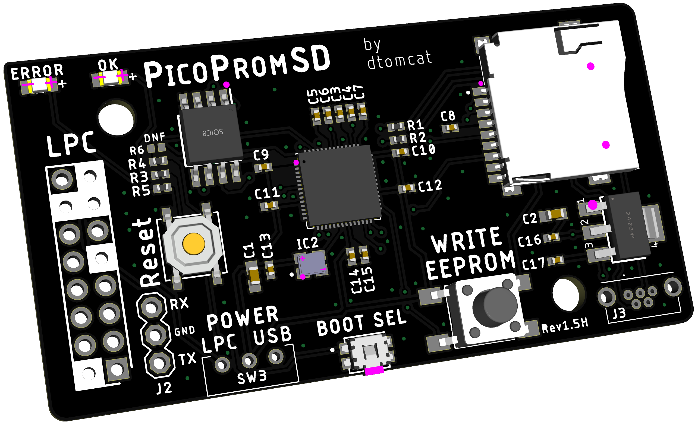
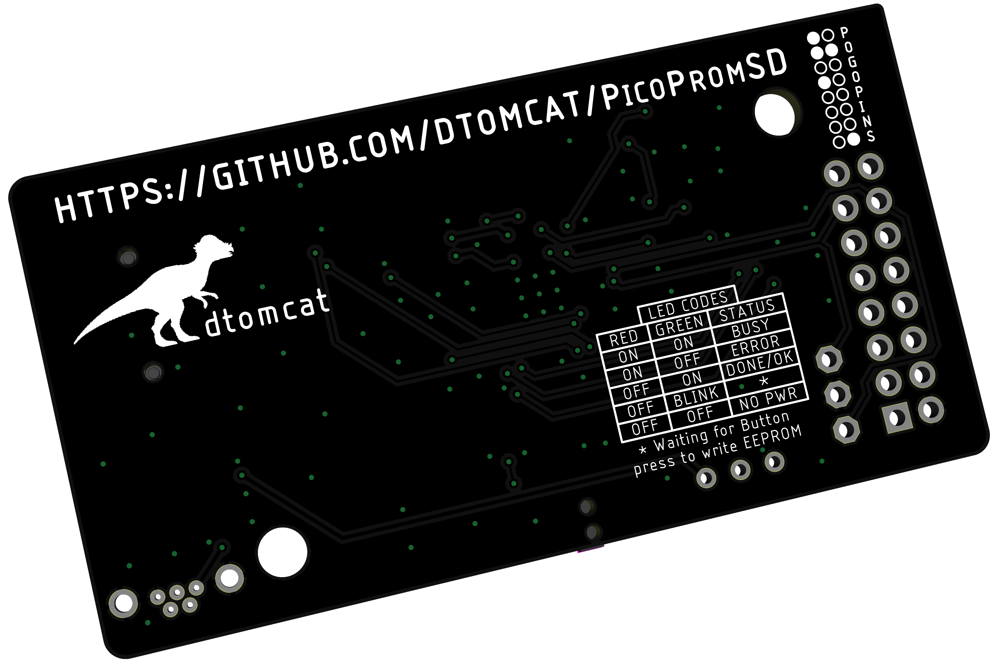

## Initial release of picoPromSD
Initial release that contains everything needed to either make or have one assembled
This revision is an edit from the first release.  All edits were done by Harcroft who put a lot of time in effort into find same quality alternate parts at lower costs so picoPromSD could be build at a lower cost without sacrificing quality or functionality!   

 
 

In the main Rev1.5H directory are all the files to edit the board as you want including library of all components.

### Gerbers
- Contains all files necessary to have the PCBs made at your preferred PCB house.  

### Assembly
- Contains all files necessary to have the PCBs made and assemble at your preferred PCB house. (was made for JLCPCB, but may work with others)
    - [PicoPromSD_v1.5H_JLC_PCBA_BOM.xlsx](Assembly/PicoPromSD_v1.5H_JLC_PCBA_BOM.xlsx) and [PicoPromSD_v1.5H_top_JLC_CPL.csv](Assembly/PicoPromSD_v1.5H_top_JLC_CPL.csv) are the files JLCPCB will ask for when selecting assembly.
    - [PicoPromSD_v1.5H_LCSC_THT_BOM.xlsx](Assembly/PicoPromSD_v1.5H_LCSC_THT_BOM.xlsx) is the parts you'll need (from LCSC) that are not a part of the assembly and will need to be hand soldered on.  These are through hole components and were purposely omitted from the assembly to save costs since through hole adds a considerable amount to assembly costs.
    - [PicoPromSD_v1.5H_Digikey_BOM.xlsx] contains a full BOM to allow you to order all the parts and hand assemble the entire board. (or would just like to use parts from Digikey instead of LCSC).